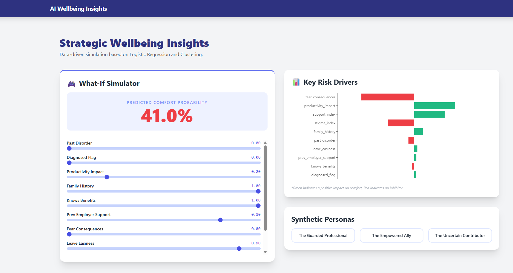

# 🧠 Employee Wellbeing & Mental Health Analytics

### *A Predictive and Generative Data Product Pipeline*



## 📌 Project Overview

This project delivers an end-to-end analytical framework designed to quantify and predict psychological safety and mental health trends within corporate environments. Transitioning from raw survey data to a predictive engine, the system now features a Strategic Interactive Dashboard that allows HR leaders to simulate scenarios and visualize risk drivers in real-time.

## 🏗️ Technical Architecture

The project follows a Medallion Data Architecture integrated with a modern Frontend:

- Silver Layer: Standardized cleaning and normalization.

- Gold Layer: High-value features (Support & Stigma Indices).

- Analysis Layer: Statistical artifacts and model benchmarks.

- Presentation Layer: React-based interactive dashboard for "What-If" simulation.

-----

## 🚀 Key Features & Methodology

### 1\. Statistical Target Ranking

Before modeling, we performed a **Quality Benchmark** on multiple candidate targets. Using **Mutual Information (MI)** and balance scores, we identified `comfort_supervisor` as the most reliable indicator of workplace trust.

### 2\. Advanced Feature Engineering (Composite Indices)

We moved beyond individual survey questions by constructing latent organizational constructs:

  * **Support Index:** Quantifies benefits awareness and organizational resources.
  * **Stigma Index:** Measures the "Silence Cost" and perceived career risk of disclosure.

### 3\. Archetypal Discovery (Unsupervised Learning)

Using **K-Means (Optimized via Silhouette Analysis)**, we identified two critical personas:

  * **Protected Advocates:** High trust, high awareness, low perceived stigma.
  * **Silent Risk Group:** 93.3% history of disorders but lowest disclosure rates due to high perceived stigma.

### 4\. Supervised Benchmarking (Logistic Regression vs. Random Forest)

We implemented a competitive modeling pipeline. **Logistic Regression** emerged as the winner with **80.14% Accuracy**, demonstrating a strong linear relationship between structural workplace drivers and individual comfort.

### 5\. GenAI-Ready Handover Pipeline

The backend culminates in an automated export of **JSON artifacts**. This kit bridges the gap between predictive logic and Generative AI, providing semantic prompts and predictive weights for automated communication campaigns.

### 6\.Interactive Strategic Dashboard
A React-powered interface that allows users to:

* **What-If Simulator:** Adjust employee variables (Fear of consequences, Stigma, etc.) to see real-time probability changes.

* **Key Risk Drivers:** Dynamic visualization of which factors are inhibiting or driving comfort.

* **Synthetic Personas:** Quick-access profiles to understand different employee archetypes.

-----

## 📊 Performance Metrics

| Metric | Logistic Regression (Winner) | Random Forest |
| :--- | :--- | :--- |
| **Accuracy** | **80.14%** | 78.75% |
| **F1-Score (Weighted)** | **0.79** | 0.77 |
| **Primary Drivers** | Stigma Index, Support Index | Stigma Index, Leave Easiness |

-----

## 📁 Repository Structure

```bash
├── data/
│   ├── raw/               # Original survey data
│   ├── processed/         # Silver (Cleaned) & Gold (Features) layers
│   ├── analysis/          # Statistical reports
│   ├── models/            # Model artifacts (.pkl)
│   └── for_genai/         # JSON metadata for Generative AI 
├── frontend/              # React + Tailwind CSS Dashboard
│   ├── src/               # Components (Simulator, Charts, Personas)
│   └── public/            # Assets
├── images/                # Benchmarking plots and persona visualizations
├── src/                   # Modular Python scripts (Cleaning, Clustering, Features, Modeling, Export)
├── requirements. txt      # Libraries
└── notebooks/             # Orchestration (main.ipynb, simulator.ipynb)
```

-----

## 🛠 Technical Stack

Data Science:
* Python
* Pandas
* NumPy
* Scikit-learn
* KMeans Clustering
* Logistic Regression
* Random Forest
* Silhouette Analysis

Frontend (UI/UX):

* React.js: Functional components and State management.
* Tailwind CSS: Professional utility-first styling.
* Recharts: Interactive data visualization for risk drivers.
* Lucide React: Iconography.

-----

## 🧮 Outputs

The pipeline generates a set of production-ready artifacts used for decision-making and downstream integration:

- **Cleaned Dataset:** A standardized Silver Layer version of the raw survey data.

- **Feature-Engineered Dataset:** The Gold Layer containing composite indices ready for modeling.

- **Cluster Metrics:** Statistical summaries and fingerprints of the identified employee personas.

- **Model Prediction Files:** Probabilistic predictions of employee comfort levels.

- **Serialized Artifacts:** High-performance .pkl models and serialized thresholds for real-time inference.


-----

## 🔄 Installation & Usage

1.  **Clone the repository:**
    ```bash
    git clone https://github.com/your-username/mental-health-analytics.git
    ```
2.  **Install dependencies:**
    ```bash
    pip install -r requirements.txt
    ```
3.  **Run the Pipeline:**
    Open `main_notebook.ipynb` and execute all cells to reproduce the cleaning, clustering, modeling, and export phases.

4. **Frontend Setup**
    ```bash
      cd frontend
      npm install
      npm start
    ```
  The dashboard will be available at http://localhost:3000.

-----

## 🏆 Business Impact

  * **Proactive Intervention:** Identifies "Silent Risk" employees before burnout or turnover occurs.
  * **Data-Driven Culture:** Provides HR with quantifiable "Stigma" and "Support" metrics to measure the ROI of wellness initiatives.
  * **Personalization at Scale:** The GenAI bridge allows for the automated generation of tailored support messages based on individual predictive profiles.
  * **Scenario Simulation:** HR can test "What-if" we improve the Support Index? to see the impact on organizational comfort.

-----

## 🎯 Final Reflection

The journey through this project highlights a fundamental shift in HR analytics: moving from clinical symptoms to organizational systems. By prioritizing the "Stigma Index" and "Supervisor Comfort" as primary predictive drivers, the model proves that psychological safety is not an individual trait but an environmental outcome. 

The integration with Generative AI marks the next frontier for this work—not just predicting risk, but automating the empathy and communication needed to mitigate it. This project stands as a testament to how data science can be both mathematically rigorous and profoundly human-centric.

The addition of the Interactive Dashboard transforms abstract coefficients into a tangible tool for empathy and decision-making, bridging the gap between data science and human-centric HR leadership.

-----

## Author

**Bárbara Ángeles Ortiz**


[LinkedIn](https://www.linkedin.com/in/barbaraangelesortiz/) | [GitHub](https://github.com/BarbaraAngelesOrtiz)

 


 📅 April 2026


